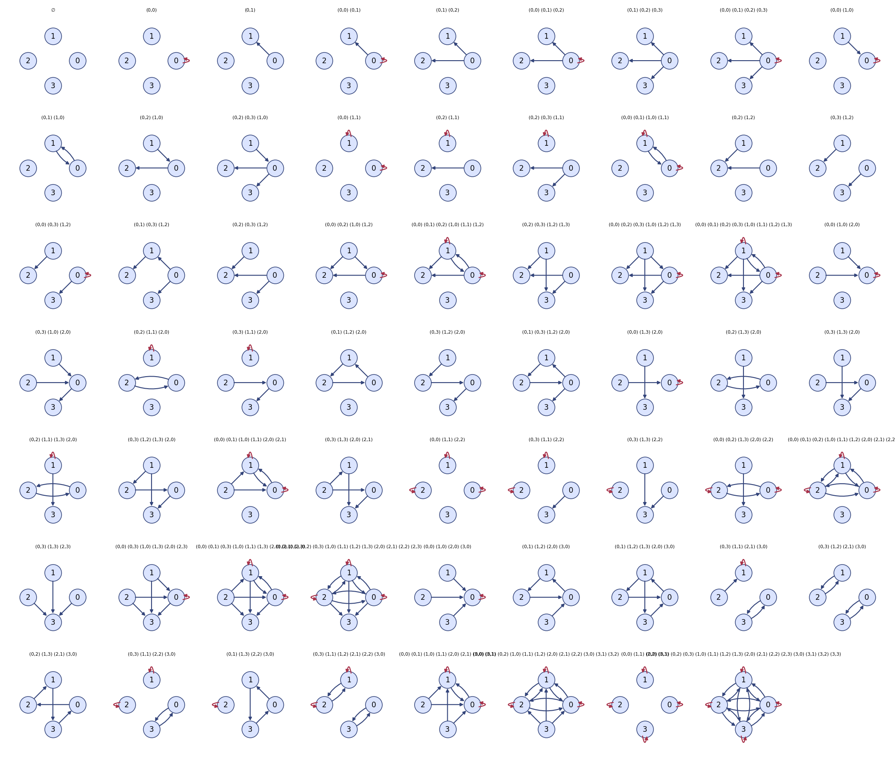
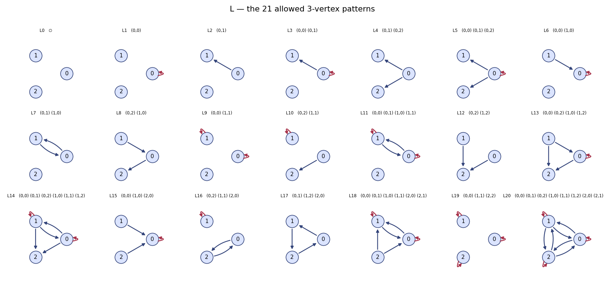
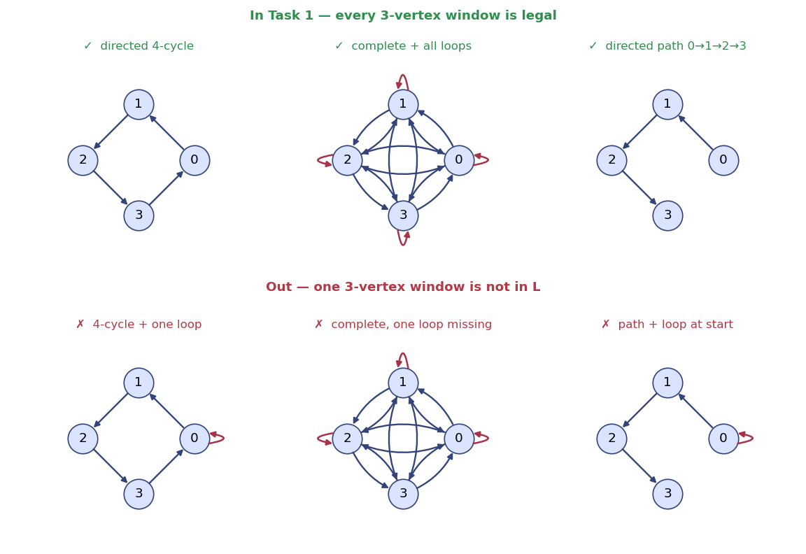
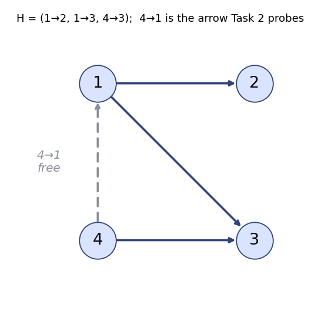
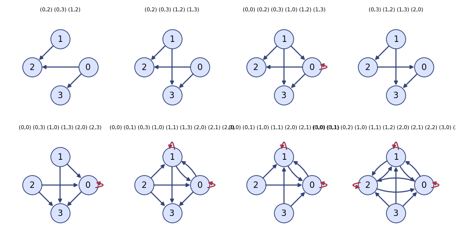

<h1 align="center">Digraphs</h1>

<p align="center">
  
</p>

A little tool that enumerates every directed graph on four vertices obeying one purely *local* rule — then draws all 62 survivors and counts them exactly. Self-loops allowed, isomorphism handled for you, no estimates anywhere.

The premise is almost unfair in its simplicity. You hand it a 21-shape "alphabet" of legal 3-vertex patterns, and it asks: which 4-vertex digraphs can be tiled *entirely* out of legal 3-vertex windows? About 98% of them can't — one rogue vertex is enough to break the whole thing. What's left is a small, exact, computer-checked catalogue (the hero grid above), plus a second task that pins down whether one particular arrow is ever *forced*. It's a small proof that happens to render nicely.

Here's the whole thing running:

```
$ python main.py

Task 1  (all induced 3-vertex subgraphs in L): 62 graphs
    1. (no edges)
    2. (0,0)
    3. (0,1)
    4. (0,0), (0,1)
    5. (0,1), (0,2)
    ...

Task 2  (Task 1 + property (i), default mode): 8 graphs
    1. (0,2), (0,3), (1,2)
    2. (0,2), (0,3), (1,2), (1,3)
    3. (0,0), (0,2), (0,3), (1,0), (1,2), (1,3)
    ...
```

**What you're looking at:**

- **Each numbered line is one digraph**, written as its edge list `(from,to)`. `(0,1)` is an arrow from vertex 0 to vertex 1; `(0,0)` is a self-loop on vertex 0; `(no edges)` is the empty graph.
- **Task 1** is every 4-vertex digraph (up to relabelling) whose four induced 3-vertex subgraphs are *all* in the allowed alphabet **L** — 62 of them.
- **Task 2** is the subset of those that also satisfy *property (i)*, a question about a fixed pattern H — 8 by default, 3 in strict mode.

---

## What it computes

Everything hinges on **L**, the alphabet: 21 allowed 3-vertex patterns, loaded from `data/my_graphs.pkl` (never hardcoded). They range from the empty graph up to the fully-connected all-loops triangle.

<p align="center"></p>

**Task 1 — local consistency.** Take a 4-vertex digraph. Delete each vertex in turn: that leaves four induced 3-vertex subgraphs, four "windows" onto the graph. The graph is *in* Task 1 iff every one of those four windows is (isomorphic to) a pattern in L. One illegal window and the graph is out. The three verified must-includes and must-excludes below make the idea concrete — the excluded ones each differ from an included one by a single self-loop that spoils a window:

<p align="center"></p>

**Task 2 — the free arrow.** On top of Task 1 there's *property (i)*, built around a fixed 4-vertex pattern **H** with edges `1→2, 1→3, 4→3`. Whenever H embeds into a graph `G`, there's one adjacency it says nothing about: the arrow `4→1`. Property (i) asks whether H can embed *without* that arrow present.

<p align="center"></p>

- **Default mode:** at least one embedding of H has `4→1` **absent**.
- **Strict mode** (`--strict-both`): at least one embedding has it **absent** *and* at least one has it **present** — the graph witnesses the arrow both ways.

Task 2 is exactly the Task 1 graphs that also pass property (i): 8 in default mode, 3 in strict.

<p align="center"></p>

---

## What it shows mathematically

Let **𝒞** be the class of all digraphs (self-loops allowed) in which *every* induced 3-vertex subgraph is one of the 21 patterns in L. That's a **hereditary class** — closed under taking induced subgraphs — which is the same as saying "forbid every 3-vertex pattern not in L." The class is pinned down entirely by 3-vertex data.

Four vertices is the first order where that constraint has any real bite. Order ≤ 2 is automatic, and order ≤ 3 is just L by definition; `n = 4` is the first layer where a graph can pass every local check and still be forced to exist — or not. **The tool computes that layer exactly: of the 3044 isomorphism types of 4-vertex digraph, exactly 62 survive.**

The search is genuinely exhaustive. It walks all `2^16 = 65,536` labelled digraphs, reduces them to their 3044 isomorphism classes (a number the test suite independently re-derives), and checks every class. So these are **exact results, not samples** — a small computer-assisted proof. And the headline is a little striking: roughly **98% of four-vertex digraphs are killed by a purely local 3-vertex rule**. The survivors are precisely the ones that can be tiled consistently by legal 3-vertex windows; a single rogue vertex breaks it.

**Task 2 is a non-forcing result.** Property (i) asks whether H can sit inside a member of 𝒞 *without* the `4→1` arrow. Getting **8** (and **3** in strict mode) rather than 0 proves that H does **not force** `4→1` within 𝒞 — that adjacency is genuinely free. The three strict-mode graphs are the sharpest witnesses of all: in each, H embeds two different ways that *disagree* about `4→1`. Those are exactly the objects you exhibit to show that an implication fails, or that a characterisation is tight.

> **Honest scope.** This verifies consequences up to order 4 and says nothing directly about `n ≥ 5`. A hereditary class is fixed by its *whole* forbidden set, so what you have here is the base/crux case — the finite, exact check at the first interesting order, not a proof about all sizes.

<details>
<summary>Where does 3044 come from?</summary>
<p>There are 2<sup>16</sup> = 65,536 labelled digraphs on 4 vertices (each of the 16 ordered pairs, loops included, present or not). Grouping them so that graphs equal after some relabelling of the vertices count once collapses them to <b>3044</b> distinct isomorphism types. The tool computes this by canonicalising every mask and counting distinct results, and the test suite asserts the 3044 figure directly — it's a free correctness check on the whole enumeration.</p>
</details>

---

## Install

Two routes. Route A brings its own Python and libraries and needs no Python knowledge. Route B is a normal Python setup.

### Route A — VS Code + Dev Containers (zero Python setup)

You install two things; the container handles the rest.

1. **Docker Desktop** — the engine that runs the container. Download: <https://www.docker.com/products/docker-desktop/>. Install it, launch it, and leave it running.
2. **Visual Studio Code** — <https://code.visualstudio.com/>.
3. The **Dev Containers** extension: <https://marketplace.visualstudio.com/items?itemName=ms-vscode-remote.remote-containers> (or search "Dev Containers" in VS Code's Extensions panel and click Install).

Then:

```
git clone https://github.com/Ma1achy/Digraphs.git
cd Digraphs
code .
```

When VS Code offers **"Reopen in Container"**, click it. (Missed it? Press `F1`, run **Dev Containers: Reopen in Container**.) First build takes a minute or two; after that you get a terminal inside the container with everything installed.

### Route B — plain Python + pip (no Docker)

You need **Python 3.11 or newer** (<https://www.python.org/downloads/>; on Windows tick *"Add Python to PATH"*). Then:

```
git clone https://github.com/Ma1achy/Digraphs.git
cd Digraphs
python -m venv .venv
```

Activate the environment — macOS/Linux: `source .venv/bin/activate`; Windows PowerShell: `.venv\Scripts\Activate.ps1` — then:

```
pip install -r requirements.txt
```

(Use `python3` / `pip3` if that's what your system calls them.)

---

## Usage

Run both tasks and print the counts and edge lists:

```
python main.py
```

You'll see the 62 Task 1 graphs, then the 8 Task 2 graphs, each as an edge list.

| Flag | What it does |
|------|--------------|
| *(none)* | Run both tasks, print counts + edge lists. Task 1 = **62**, Task 2 = **8**. |
| `--strict-both` | Use strict mode for property (i). Task 2 drops to **3**. |
| `--draw` | Also write `task1.png` and `task2.png` — grids of the resulting digraphs. |
| `--data PATH` | Read the alphabet L from a different pickle (default `data/my_graphs.pkl`). |
| `--help` | Show all of the above. |

**Draw the survivors** (self-loops render as small red arcs outside each vertex; a pair of opposite arrows bows into two curved arcs so they never merge into one line):

```
python main.py --draw
```

**Strict mode** — Task 2 becomes the 3 sharpest witnesses:

```
$ python main.py --strict-both
...
Task 2  (Task 1 + property (i), strict mode): 3 graphs
```

**A different alphabet:**

```
python main.py --data path/to/my_graphs.pkl
```

---

## How it works

A 4-vertex digraph is a **16-bit integer**. Bit `4*u + v` is set iff the arrow `u → v` is present; the four diagonal bits `0, 5, 10, 15` are the self-loops. So all 65,536 graphs are just `range(1 << 16)`, and edges, subgraphs, and pattern checks become fast bitwise operations.

Two graphs are the same iff one is a relabelling of the other. The **canonical form** of a graph is the *smallest* of its 24 relabelled masks; isomorphic graphs share a canonical form, and the distinct canonical forms are exactly the 3044 isomorphism classes. Both task properties are isomorphism-invariant, so each is evaluated once per class representative (~3044 checks), never per labelled graph. The whole run finishes in well under a second.

<details>
<summary>The fast path (canonical forms in one vectorised pass)</summary>
<p>Rather than canonicalising graphs one at a time, the enumerator takes a single NumPy pass over <code>arange(1 &lt;&lt; 16)</code>: for each of the 24 vertex permutations it computes the permuted mask of <i>every</i> graph at once (relocating all 16 bits with shifts and OR), then takes the element-wise minimum across the 24 arrays. The number of distinct values is the 3044 count — which doubles as an independent correctness check on the enumeration. No external isomorphism solver is involved.</p>
</details>

---

## Tests

The suite checks every count and every hand-verified reference case. Route A already has `pytest`; on Route B install it once with `pip install pytest` (or `pip install -e ".[test]"`). Then, from the project folder:

```
pytest
```

A passing run is a row of dots and a green summary:

```
..........................                                       [100%]
26 passed in 1.10s
```

What it locks down:

| Quantity | Expected |
|----------|----------|
| Isomorphism classes of 4-vertex digraphs | **3044** |
| Distinct patterns in the alphabet L | **21** |
| Task 1 | **62** |
| Task 2, default mode | **8** |
| Task 2, strict mode | **3** |
| Task 2 ⊆ Task 1 | true |

On top of the counts: canonical-form invariance under relabelling, the induced-subgraph and property-(i) helpers, L loading from the pickle, committed **golden snapshots** of the full Task 1 / Task 2 edge-lists (so the exact result is pinned, not just its size), and a named `test_irene_reference_cases` covering the six must-include / must-exclude graphs by hand.

> The counts are treated as ground truth. If the code and the expected numbers ever disagree, the tests win and the code is the thing to fix — the expected values are never weakened to make a run go green.

---

## Development

```
Digraphs/
  main.py                     # CLI entry point (thin — parses args, calls the package)
  src/digraph_enum/
    graphs.py                 # bitmask <-> edges, canonical form, enumeration
    constraints.py            # induced-subgraph check, L membership, H / property (i)
    tasks.py                  # task1(), task2(strict_both=False)
    draw.py                   # grid drawing (self-loops + antiparallel arcs)
    cli.py                    # argparse wiring
  scripts/
    render_readme_assets.py   # regenerate every image in assets/
  tests/                      # pytest suite + golden snapshots
  data/my_graphs.pkl          # the alphabet L (committed)
  assets/                     # README images (generated)
```

Every image in this README is generated deterministically from the code and the committed data. To regenerate them after a change:

```
python scripts/render_readme_assets.py
```

It reuses the package's own drawing code, so the figures always match what `--draw` produces.

---

Unlicensed (no `LICENSE` yet) · made by [@Ma1achy](https://github.com/Ma1achy) as a small exact answer to a small exact question.
